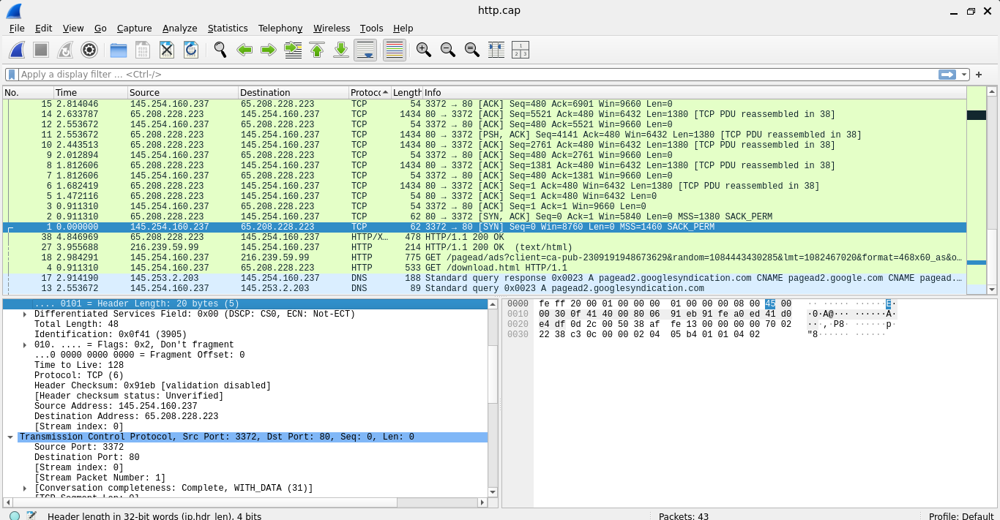
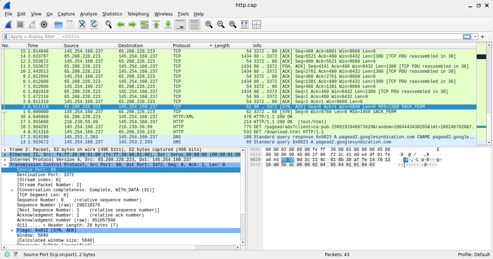
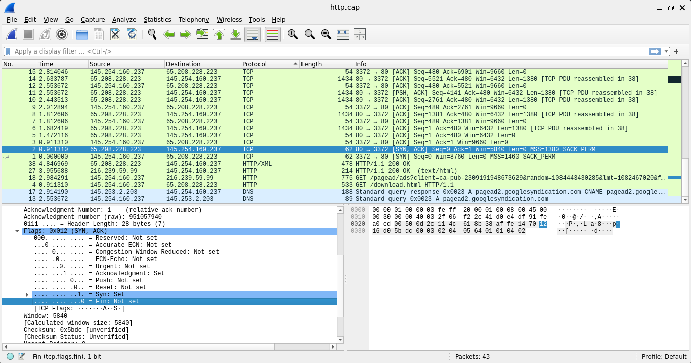
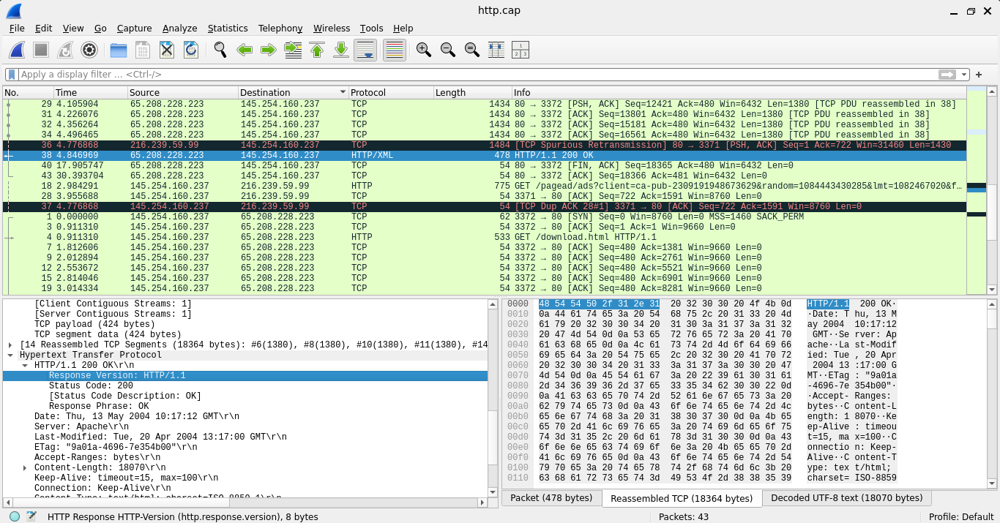

# Wireshark Fundamentals: Reading Traffic at the Protocol Level

## Overview

Before working through a full investigation, I spent time getting comfortable with the mechanics of Wireshark itself: reading raw packet fields, applying filters, and reconstructing full conversations from individual packets. This project documents that groundwork using `http.cap`, a well known sample capture that ships with Wireshark, showing a simple web browsing session.

The goal here wasn't to find anything suspicious. It was to build fluency with the tool and the protocols before applying that skill to a real investigation.

## Tools Used
- Wireshark
- Display filters
- Manual inspection of packet header fields

## What I Practiced

### Reading the TCP Handshake

I traced a full TCP three way handshake packet by packet, starting with the initial SYN, then the SYN ACK response from the server, and manually inspected the flag bits in each packet rather than relying on Wireshark's summary line. Reading flags directly at the byte level makes it much clearer what "SYN" or "ACK" actually represents inside a packet, rather than just recognizing the label.

### Filtering for HTTP Requests

Using the `http.request` filter, I isolated only the outbound web requests in the capture, cutting out everything else, and confirmed the exact GET requests being made along with their full request headers.

### Filtering DNS Activity

Using the `dns` filter, I isolated the domain name lookups happening in the background of the browsing session, and matched each query to its corresponding response.

### Understanding TCP Reassembly and Retransmission

I reviewed how Wireshark reassembles a single HTTP response that was split across multiple TCP segments, and identified a spurious retransmission in the capture, a case where a packet gets resent even though it was likely already received, usually due to a delayed acknowledgment rather than actual packet loss.

## What I Learned

This exercise was less about finding something and more about slowing down enough to actually understand what Wireshark is showing me by default. Reading TCP flags manually instead of trusting the summary column made the handshake process click in a way that just reading about it never did. It also gave me a clear before and after reference point: this is what ordinary, harmless traffic looks like, which made it much easier to recognize when something didn't fit that pattern in the actual investigation that followed.
