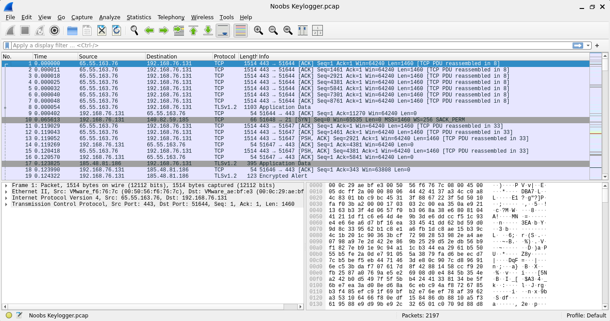
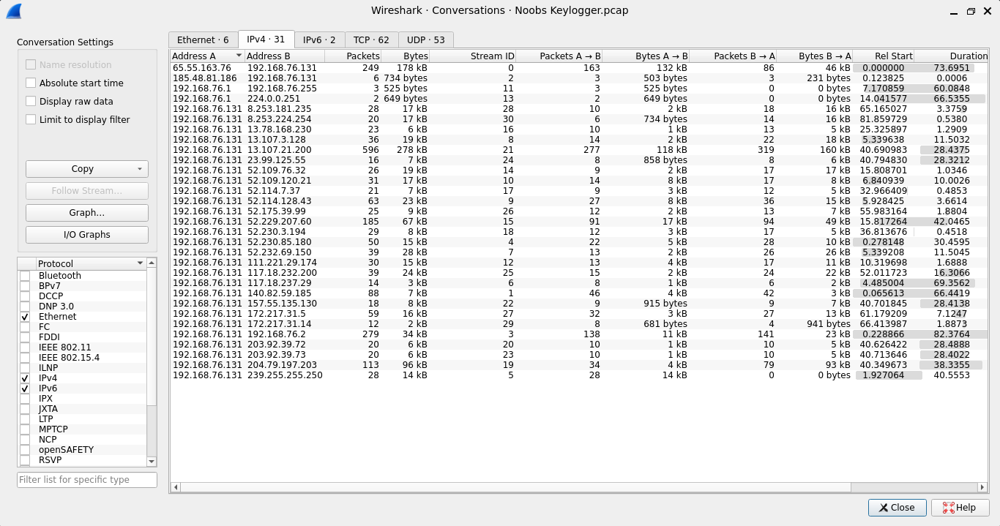
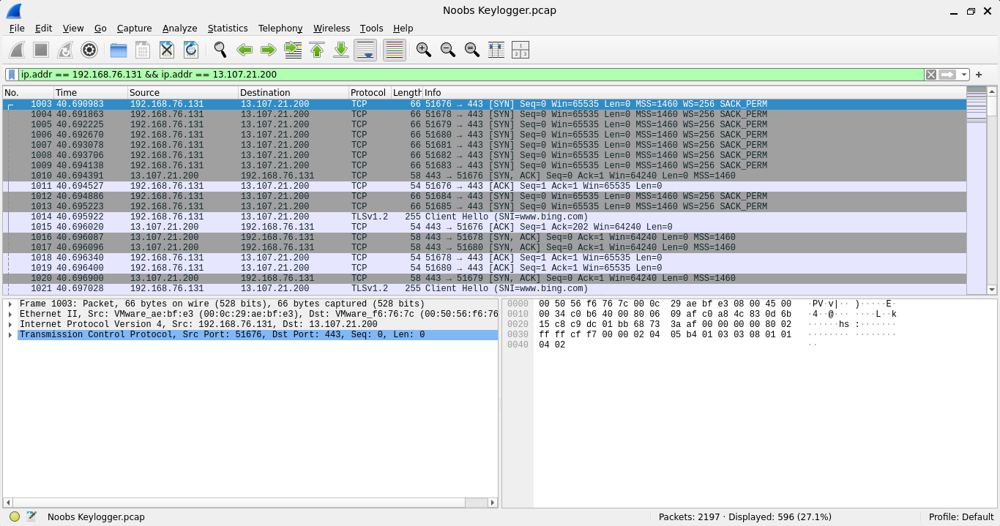
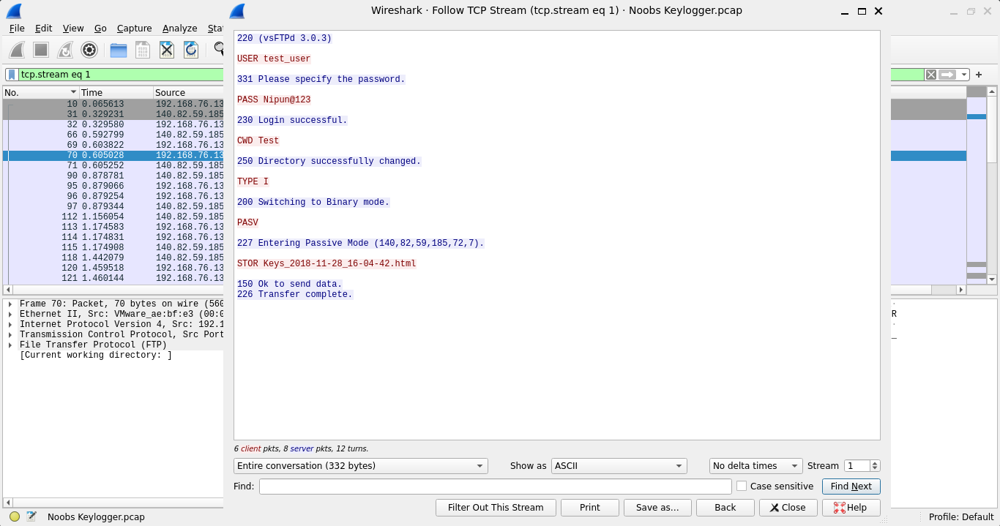
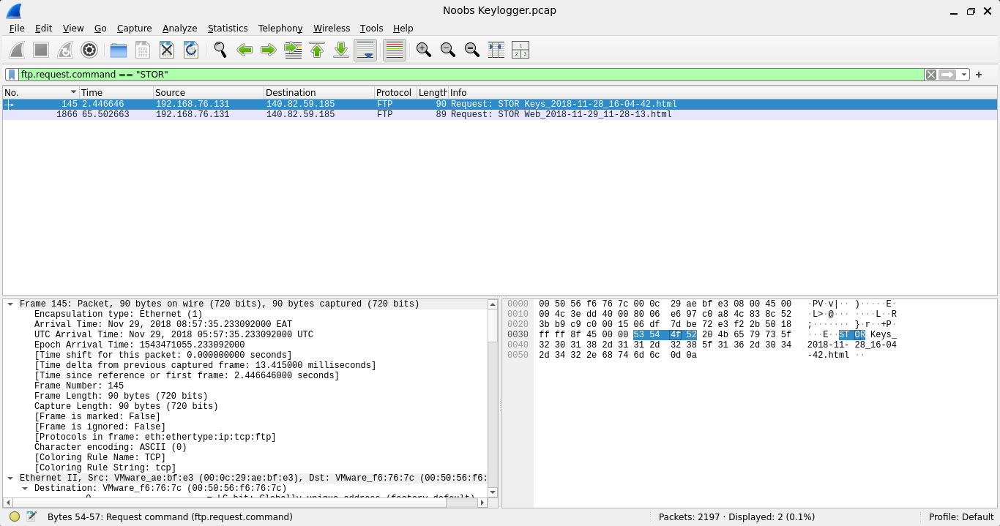
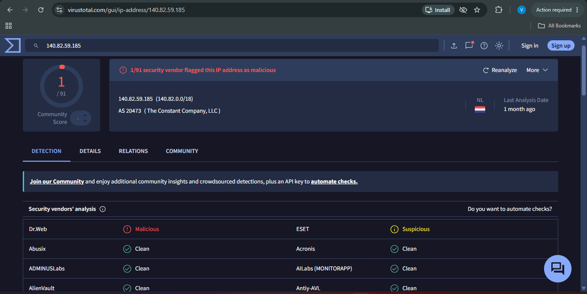

# Network Forensics: Investigating a Keylogger Infection

## Overview

This project simulates a real incident response scenario. A keylogger, malicious software that secretly records what a user types, had been planted on a machine inside a monitored network. Working only from a recorded snapshot of network traffic, the task was to identify the infected machine, trace where the stolen data was being sent, determine how often it was transmitted, uncover what information was being taken, and attempt to attribute the activity to an attacker.

In a live environment, this kind of investigation typically begins by capturing traffic from a mirror port, a point on a network switch configured to receive a copy of all traffic passing through it, allowing an analyst to observe activity without accessing any individual machine directly. That capture would normally be initiated with a command such as:

```
tcpdump -i eth0 -w capture.pcap
```

For this exercise, the analysis was performed on a pre-recorded capture file (`Noobs Keylogger.pcap`) representing that traffic, using Wireshark to inspect it in the same way a live capture would be reviewed.

## Tools Used
- Wireshark, for packet capture analysis
- Wireshark Conversations view, to identify hosts generating unusual traffic volume
- Wireshark Follow Stream, to reconstruct full sessions from individual packets
- Wireshark Export Objects, to recover files transferred across the network
- VirusTotal, to check the reputation of the identified server

## Investigation

### 1. Identifying the Infected Host

Reviewing Statistics > Conversations surfaced one internal address, `192.168.76.131`, appearing consistently throughout the capture with a disproportionate amount of outbound activity. Given its private IP range, this stood out as the likely infected machine early in the analysis.

**Infected host:** `192.168.76.131`




### 2. Tracing the Exfiltration Path

The largest conversation by volume involved `13.107.21.200`. Investigating it first was the right instinct, but following the stream showed a standard TLS handshake with the SNI field `www.bing.com`, confirming this was ordinary encrypted web traffic rather than the exfiltration channel. Ruling this out was a useful step in itself, and it's included here deliberately, since documenting what was eliminated is as much a part of a sound investigation as documenting what was confirmed.

The actual lead was a single, easily overlooked SYN packet directed at `140.82.59.185` on port 21, the port used for FTP. FTP is a legacy file transfer protocol that transmits everything, including login credentials, in plain text, making it a common (if unsophisticated) choice for data exfiltration.

**Exfiltration server:** `140.82.59.185`, over FTP




Reconstructing the FTP session revealed the full exchange:
- Server banner identified the software as vsFTPd 3.0.3
- Authentication occurred with the credentials `test_user` / `Nipun@123`, transmitted unencrypted
- The session changed into a directory named `Test`
- The connection switched to binary transfer mode and negotiated passive mode
- A file was uploaded: `Keys_2018-11-28_16-04-42.html`
- The transfer completed successfully

### 3. Establishing Transmission Frequency

Filtering the full capture for FTP upload commands returned exactly two events:

1. `Keys_2018-11-28_16-04-42.html`, transmitted early in the capture
2. `Web_2018-11-29_11-28-13.html`, transmitted roughly 63 seconds later

**Frequency:** the two observed uploads occurred about a minute apart. Notably, the filenames themselves carry timestamps a full day apart from one another, despite being sent within a minute of each other in this capture. This is a meaningful detail rather than a discrepancy: it indicates the keylogger maintains separate log categories (keystroke activity and browsing/window activity) locally, then periodically uploads whatever has accumulated in each, rather than transmitting continuously as data is captured.



### 4. Scope of Data Collected

Recovering and reviewing both uploaded files showed the tool's collection went well beyond keystrokes:

- The first file logged the active application (`explorer.exe`) with a timestamp, and included the label `Ardamax_FTP_Delivery`. This detail identifies the specific tool used in the attack: Ardamax Keylogger, a commercially available product frequently repurposed for unauthorized surveillance.
- The second file logged the active window title, `nipun : Start - Microsoft Edge`, along with a captured URL, `http://gmail.com`, confirming the tool also tracked browsing activity and window focus.

**Data collected:** keystrokes, active window titles, application usage, and visited URLs.

Both recovered files are included in this repository under [`evidence/`](./evidence/) for direct review.

### 5. Attribution

A VirusTotal lookup on `140.82.59.185` returned 1 malicious flag (Dr.Web) and 1 suspicious flag (ESET) out of 91 vendors, with the remainder reporting no known issues. The address is registered to a US-based hosting provider.

This result carries limited weight on its own. IP addresses are frequently reassigned or shared across unrelated infrastructure, so a low detection count doesn't meaningfully rule out malicious use, nor does it confirm it. The stronger and more reliable evidence for attribution came directly from the traffic itself: exposed plaintext credentials, a consistent file naming convention, and an explicit tool identifier ("Ardamax_FTP_Delivery") recovered from the exfiltrated content. This is worth noting as a general principle: reputation lookups are a useful supplementary check, not a substitute for behavioral evidence.



### 6. File Recovery

Both exfiltrated files were recovered intact using Wireshark's Export Objects feature (FTP-DATA), enabling direct review of their contents as described above.

## Summary

The infected host, `192.168.76.131`, was running Ardamax Keylogger, which periodically exfiltrated batched activity logs to an external server at `140.82.59.185` via unencrypted FTP, exposing its own access credentials in the process. Beyond keystrokes, the tool captured active window titles, application usage, and browsing activity, transmitting this data in separate, timestamped files roughly a minute apart during the observed window. Reputation checks on the destination server returned only a weak signal, reinforcing that direct traffic analysis was the decisive factor in both identifying the infection and attributing it to a specific tool.

## Key Takeaways

The most instructive part of this exercise was that traffic volume is not a reliable indicator of threat. The largest conversation in the capture was entirely benign, while the actual attack traffic consisted of a single, minimal footprint connection that was easy to miss without deliberate filtering. It also reinforced that reputation databases should inform an investigation rather than anchor it; the strongest evidence here came from reading the protocol exchange directly rather than from an external lookup. Finally, this investigation provided practical experience reconstructing a full FTP session from raw packets and recognizing the operational signature of a real, commercially available keylogging tool.
