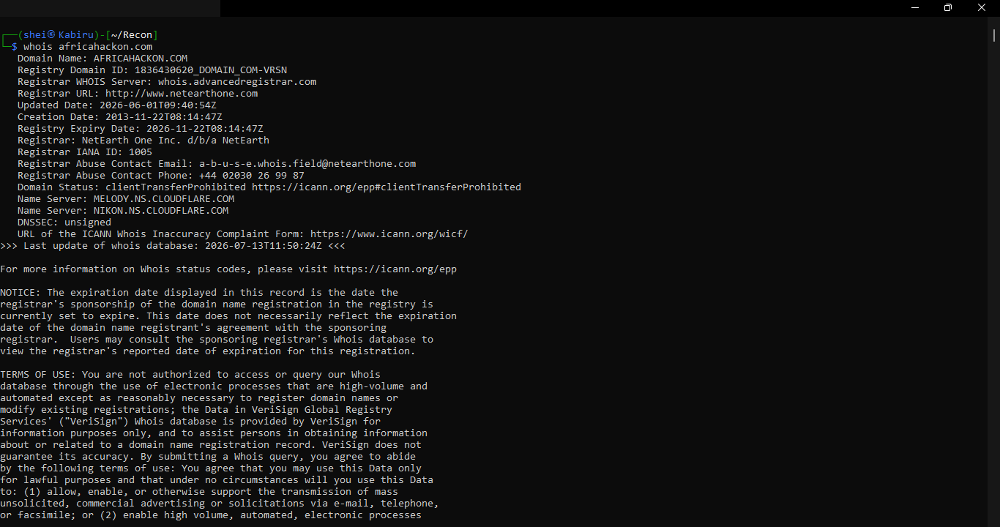
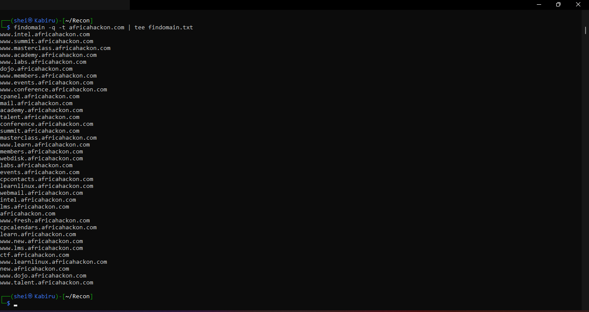
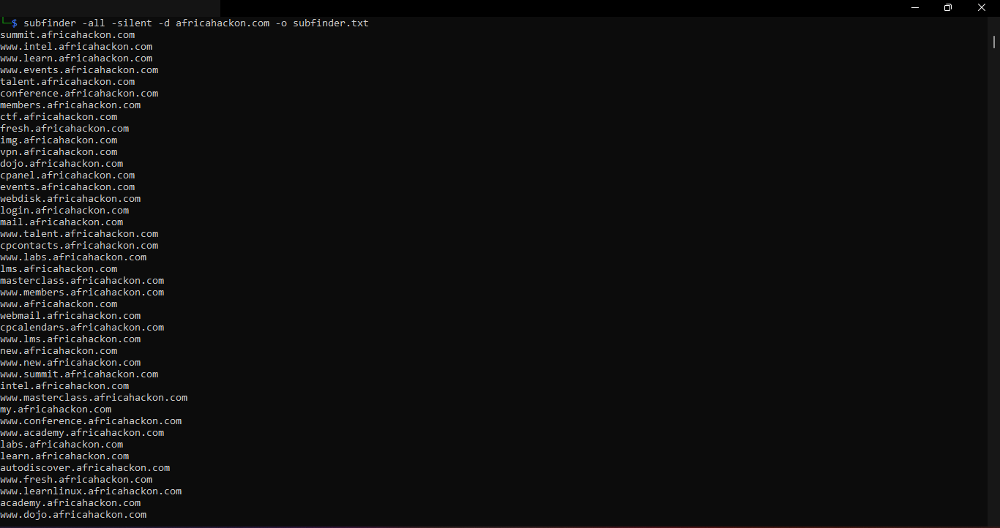
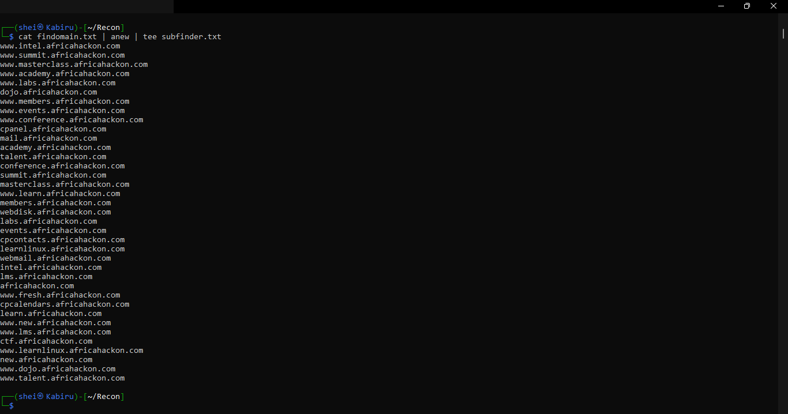
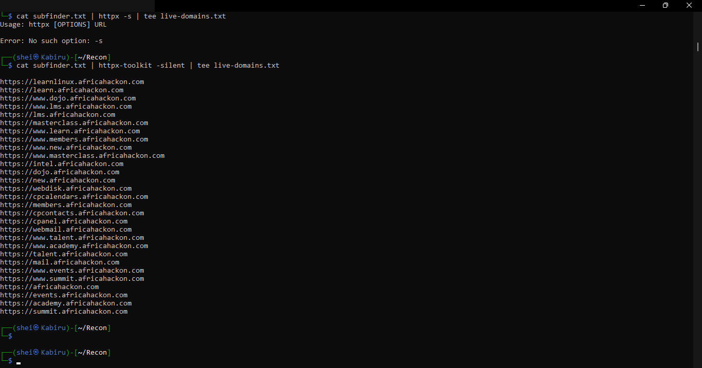
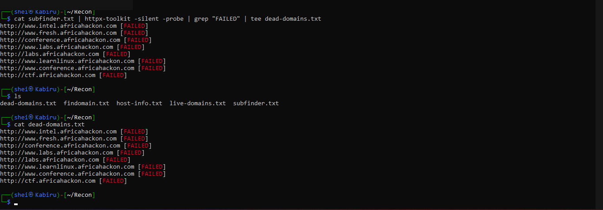
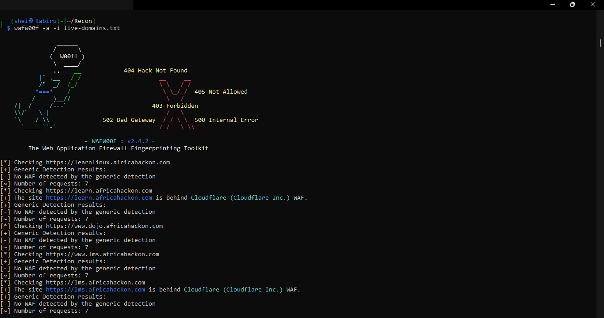
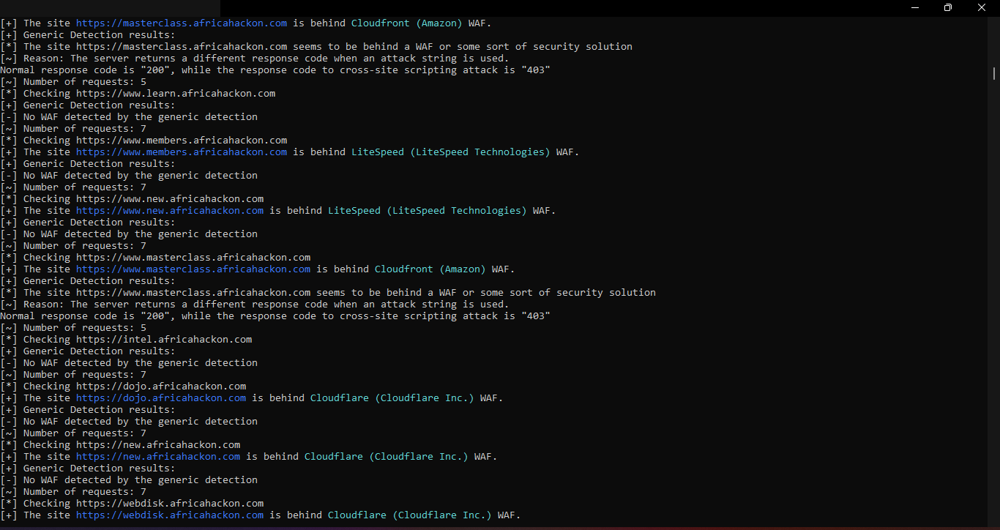

<p align="center">
  
</p>

<h1 align="center">Reconnaissance & Footprinting Report</h1>
<p align="center"><em>Assignment 1.1 — africahackon.com</em></p>

<p align="center">
  <strong>Victor Chege</strong> · 13 July 2026 · Cybersecurity — Reconnaissance & Footprinting Module
</p>

---

## Objective

Perform domain footprinting on `africahackon.com`, enumerate its subdomains, classify them as live or dead, and identify firewall/WAF configurations on live subdomains, using 5+ industry-standard reconnaissance tools.

---

## 1. Methodology

This assignment follows the standard reconnaissance workflow used in the early phase of a penetration test:

1. **Domain footprinting** — gathering registration, registrar, and nameserver data for the root domain
2. **Subdomain enumeration** — using multiple passive sources to maximize coverage
3. **Live/dead classification** — resolving and probing discovered subdomains
4. **WAF/firewall fingerprinting** — identifying defensive layers on live subdomains

All footprinting and subdomain enumeration below was conducted passively — querying third-party data sources rather than the target directly. Live/dead checks and WAF fingerprinting involve lightweight direct requests to the target's infrastructure, within the scope of this authorized coursework assignment.

---

## 2. Tools Used

| # | Tool | Purpose | Type |
|---|------|---------|------|
| 1 | `whois` | Domain registration footprinting | Passive |
| 2 | `findomain` | Subdomain enumeration | Passive |
| 3 | `subfinder` | Subdomain enumeration (cross-validation) | Passive |
| 4 | `httpx-toolkit` | Live/dead subdomain probing | Active (lightweight) |
| 5 | `wafw00f` | WAF/firewall fingerprinting | Active (lightweight) |

---

## 3. Domain Footprinting (WHOIS)

### 3.1 whois

**What it does:** whois is a query-and-response protocol used to look up public registration information about a domain name — its registrar, registrant organization, creation/expiry dates, and authoritative nameservers. It's typically the very first step in footprinting, since it requires no special tooling and immediately reveals who owns and manages the target's DNS.

**Command:**
```bash
whois africahackon.com
```

**Screenshot:**


*Figure 1 — whois lookup for africahackon.com*

**Result — key findings:**

| Field | Value |
|-------|-------|
| Registrar | NetEarth One Inc. d/b/a NetEarth |
| Creation Date | 2013-11-22 |
| Last Updated | 2026-06-01 |
| Expiry Date | 2026-11-22 |
| Domain Status | clientTransferProhibited |
| Name Servers | MELODY.NS.CLOUDFLARE.COM, NIKON.NS.CLOUDFLARE.COM |
| DNSSEC | Unsigned |

**Analysis:** The nameservers confirm the domain sits behind Cloudflare at the DNS level, which aligns with the Cloudflare WAF hits found later during wafw00f scanning. `clientTransferProhibited` is a protective status that blocks unauthorized domain transfers — a sign of good basic domain hygiene. DNSSEC being unsigned, however, is a minor gap: without it, the domain is theoretically more exposed to DNS spoofing or cache-poisoning attacks.

---

## 4. Subdomain Enumeration

### 4.1 findomain

**What it does:** findomain is a passive subdomain enumeration tool that queries multiple public data sources to discover subdomains without directly touching the target. It was run first in this assignment to establish an initial subdomain baseline.

**Command:**
```bash
findomain -q -t africahackon.com | tee findomain.txt
```

**Screenshot:**


*Figure 2 — findomain subdomain enumeration*

**Result:** Approximately 38 subdomains found, including `learnlinux.africahackon.com` and the bare root domain `africahackon.com` — both useful confirmations carried into the merged dataset.

### 4.2 subfinder

**What it does:** subfinder is a fast subdomain discovery tool that enumerates subdomains using a different combination of sources and techniques than findomain — search engines, DNS aggregators, and certificate transparency databases among them. Running it alongside findomain provides cross-validation: confirming discovered subdomains are genuine and surfacing anything the first tool missed.

**Command:**
```bash
subfinder -all -silent -d africahackon.com -o subfinder.txt
```

**Screenshot:**


*Figure 3 — subfinder subdomain enumeration*

**Result:** Approximately 42 subdomains found, with substantial overlap with findomain's results — increasing confidence that these subdomains are genuinely valid — plus additional operational subdomains (`mail`, `webmail`, `vpn`, `cpanel`) and platform subdomains (`learn`, `academy`, `lms`, `dojo`, `masterclass`).

### 4.3 Merged & Deduplicated Results

Both wordlists were combined and deduplicated to build one master list before probing:

```bash
cat subfinder.txt findomain.txt | sort -u > all_subdomains.txt
```

**Screenshot:**


*Figure 4 — merged and deduplicated subdomain list*

**Total unique subdomains found:** Approximately 44.

Running two independent passive tools and merging results demonstrates that no single source has complete visibility — cross-referencing is standard practice in real reconnaissance to maximize attack-surface coverage.

---

## 5. Live vs Dead Classification

### 5.1 httpx-toolkit — live subdomains

**What it does:** httpx-toolkit is a versatile command-line tool for making HTTP requests and probing web services. Here it confirms which subdomains are not just registered in DNS, but actually reachable and serving content over HTTP(S).

**Command:**
```bash
cat subfinder.txt | httpx-toolkit -silent | tee live-domains.txt
```

**Screenshot:**


*Figure 5 — live subdomain probing with httpx-toolkit*

**Result:** 28 live subdomains confirmed, including `learn`, `dojo`, `lms`, `masterclass`, `members`, `webdisk`, `cpanel`, `webmail`, `talent`, `mail`, `events`, `academy`, `summit`, and the root `africahackon.com`.

### 5.2 httpx-toolkit — dead subdomains

**What it does:** Re-running the probe with the `-probe` flag explicitly labels non-responsive hosts as `[FAILED]` rather than silently dropping them; filtering for that label isolates dead subdomains as their own dataset rather than inferring them indirectly from what's missing off the live list.

**Command:**
```bash
cat subfinder.txt | httpx-toolkit -silent -probe | grep "FAILED" | tee dead-domains.txt
```

**Screenshot:**


*Figure 6 — dead subdomain isolation via grep FAILED*

**Result:**

| Subdomain | Status |
|-----------|--------|
| www.intel.africahackon.com | 🔴 FAILED |
| www.fresh.africahackon.com | 🔴 FAILED |
| conference.africahackon.com | 🔴 FAILED |
| www.labs.africahackon.com | 🔴 FAILED |
| labs.africahackon.com | 🔴 FAILED |
| www.learnlinux.africahackon.com | 🔴 FAILED |
| www.conference.africahackon.com | 🔴 FAILED |
| ctf.africahackon.com | 🔴 FAILED |

**Summary:** 28 live, 8 confirmed dead, out of approximately 42 subdomains probed from the subfinder list.

*`conference.africahackon.com` and `www.conference.africahackon.com` both appearing dead is worth flagging — an event-sounding subdomain name returning no response could indicate decommissioned infrastructure, which is exactly the kind of finding reconnaissance is meant to surface for follow-up (e.g., checking for a subdomain-takeover opportunity in a real, authorized engagement).*

---

## 6. WAF / Firewall Fingerprinting

### 6.1 wafw00f

**What it does:** wafw00f sends a mix of normal and attack-like requests (such as simulated cross-site-scripting strings) to a target and compares the response codes and headers against known WAF signatures. If a WAF intercepts the malicious-looking request differently than a normal one — for example, returning 403 instead of 200 — it reveals which vendor's WAF sits in front of the site.

**Command:**
```bash
wafw00f -a -i live-domains.txt
```

**Screenshots:**


*Figure 7 — wafw00f WAF fingerprinting (part 1)*


*Figure 8 — wafw00f WAF fingerprinting (part 2)*

### 6.2 Results Table

| Live Subdomain | WAF Detected | Evidence |
|-----------------|---------------|----------|
| learn.africahackon.com | Cloudflare | Vendor signature match |
| lms.africahackon.com | Cloudflare | Vendor signature match |
| dojo.africahackon.com | Cloudflare | Vendor signature match |
| new.africahackon.com | Cloudflare | Vendor signature match |
| webdisk.africahackon.com | Cloudflare | Vendor signature match |
| www.members.africahackon.com | LiteSpeed | Vendor signature match |
| www.new.africahackon.com | LiteSpeed | Vendor signature match |
| masterclass.africahackon.com | Cloudfront (Amazon) | Different response code (200 vs 403) on attack string |
| www.masterclass.africahackon.com | Cloudfront (Amazon) | Different response code (200 vs 403) on attack string |
| learnlinux.africahackon.com | None detected | — |
| www.dojo.africahackon.com | None detected | — |
| www.lms.africahackon.com | None detected | — |
| www.learn.africahackon.com | None detected | — |
| intel.africahackon.com | None detected | — |

**Notable pattern:** this single organization's subdomains sit behind **three different WAF vendors** (Cloudflare, LiteSpeed, and Cloudfront/Amazon) plus several with no WAF at all. This suggests decentralized or inconsistent hosting and security ownership across subdomains, rather than one uniform, organization-wide security policy.

---

## 7. Findings Summary

- **Total unique subdomains discovered:** ~44 (via findomain + subfinder, merged)
- **Live:** 28 | **Dead:** 8 (confirmed)
- **WAF-protected live subdomains:** 9 (Cloudflare ×5, LiteSpeed ×2, Cloudfront/Amazon ×2)
- **No WAF detected:** 5 confirmed live subdomains

**Notable observations:**
- Security posture is inconsistent across the organization's own subdomains — three different WAF vendors in use, plus several subdomains with no WAF at all.
- Two conference-related subdomains were found dead, which could indicate decommissioned event infrastructure — a candidate worth flagging for subdomain-takeover risk if DNS records still point to an unclaimed service.
- Operational and admin-facing subdomains (`cpanel`, `webmail`, `webdisk`, `mail`, `vpn`) were discoverable through passive reconnaissance alone — representing a meaningful attack surface that would be prioritized in later phases of a real, authorized engagement.

---

## 8. Lessons Learned

Running two independent subdomain tools mattered even though their results mostly overlapped — the small number of subdomains each tool found uniquely (like `learnlinux.africahackon.com` from findomain) confirmed that no single source has complete visibility into a target's attack surface. In a real engagement, missing even one subdomain could mean missing the one vulnerable entry point.

Separating live from dead subdomains is important because dead subdomains carry a different kind of risk: they don't offer an immediately exploitable service, but they can represent forgotten infrastructure that's a candidate for subdomain takeover if DNS still points somewhere unclaimed. Live subdomains, by contrast, are the actual current attack surface and deserve deeper testing.

The mixed WAF vendor findings told me that africahackon.com's infrastructure is not centrally managed from a security standpoint — different subdomains are hosted or protected through different providers, which likely reflects organic growth over time (different teams or services being added independently) rather than a single planned security architecture.

If this were a real, authorized engagement, the next steps I would take are: investigating the dead conference-related subdomains for potential takeover, prioritizing the subdomains with no WAF detected for deeper vulnerability testing, and mapping the technologies running behind each of the three different WAF providers to understand what's actually being protected.

---

## 9. Tools Reference

- whois — standard Linux utility (`apt install whois`)
- findomain — https://github.com/Findomain/Findomain
- subfinder — https://github.com/projectdiscovery/subfinder
- httpx-toolkit — https://github.com/projectdiscovery/httpx
- wafw00f — https://github.com/EnableSecurity/wafw00f

---

<p align="center"><sub>Prepared by Victor Chege · Cybersecurity Learning Journal</sub></p>
