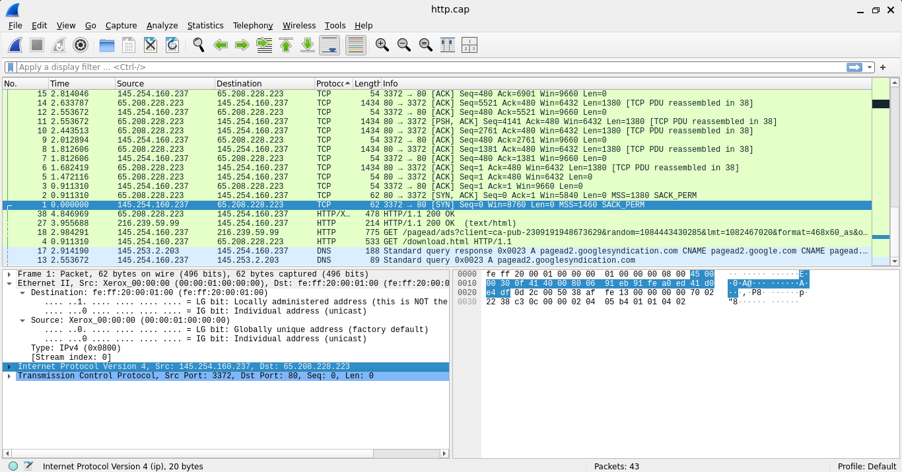
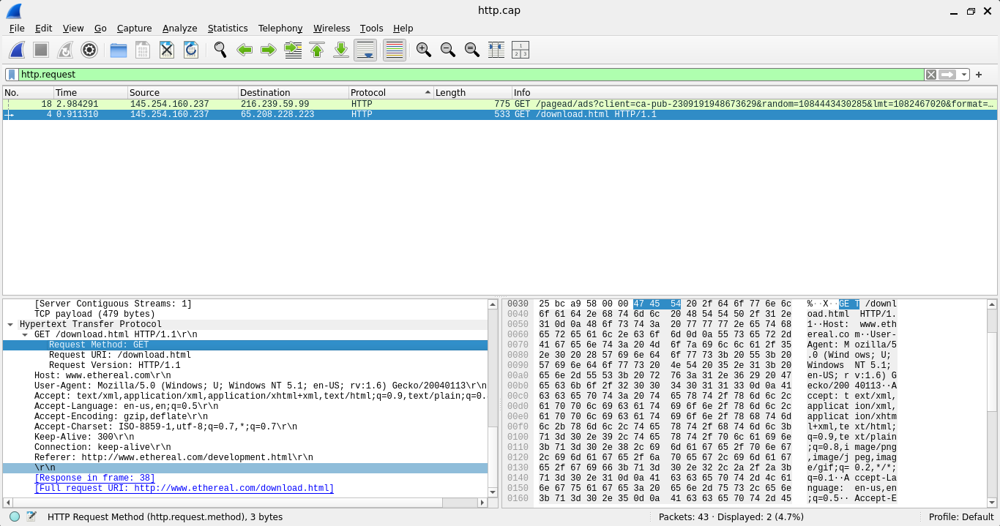
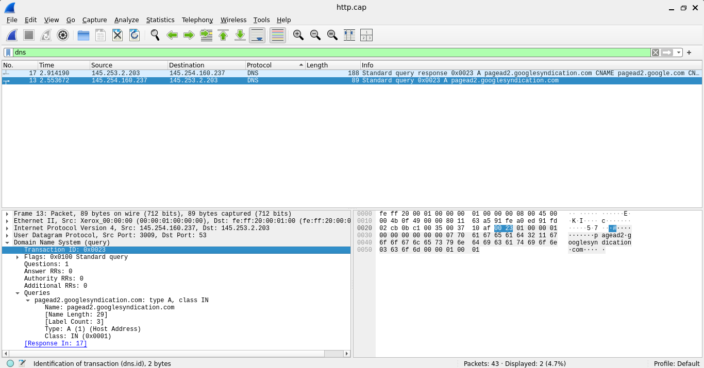

# Packet Capture Analysis: Tracing an HTTP Conversation

## Overview

For this exercise, I used Wireshark to analyze `http.cap`, a sample packet capture containing a simple web browsing session. The goal was to trace exactly what happens, at the network level, when a browser loads a webpage: how the connection is set up, how the request and response travel, and how the underlying protocols work together.

This builds directly on the networking concepts from the fundamentals module (the OSI and TCP/IP models, encapsulation, and the three way handshake).

## Tools used

- Wireshark
- Sample capture: `http.cap`

## Method

I opened the capture in Wireshark and worked through it using specific display filters to isolate the traffic relevant to each question, rather than scrolling through every packet manually. Below is the filter I used for each step, and what I found.

---

### 1. Source and destination IP addresses

**Filter used:** clicked packet 1, expanded "Internet Protocol Version 4"

**Client IP:** 145.254.160.237
**Server IP:** 65.208.228.223

**How I knew which was which:** Packet 1 is a SYN packet, and a SYN is always sent by the device initiating a connection. Since 145.254.160.237 is the source of that SYN, it is the client. 65.208.228.223 replies with SYN, ACK in packet 2, confirming it is the server.

---

### 2. Source and destination ports

**Filter used:** clicked packet 1, expanded "Transmission Control Protocol"

**Source port (client):** 3372
**Destination port (server):** 80 (the standard port for HTTP)

---

### 3. Connection establishment protocol and flags

**Filter used:** `tcp.flags.syn==1`, then manually checked packet 3

**Protocol:** TCP

**The three way handshake, confirmed in the actual packets:**

| Packet | Direction | Flags | Meaning |
|---|---|---|---|
| 1 | Client (145.254.160.237) to Server (65.208.228.223) | SYN | "I would like to open a connection" |
| 2 | Server to Client | SYN, ACK | "I accept, and I acknowledge your request" |
| 3 | Client to Server | ACK | "Confirmed, connection established" |

This handshake is how TCP guarantees both sides agree a connection exists before any actual data is sent.

---

### 4. HTTP method and requested resource

**Filter used:** `http.request`

**Method:** GET
**Resource requested:** /download.html
**Host:** www.ethereal.com
**Full URL:** http://www.ethereal.com/download.html

This was found in packet 4, the GET request itself, which also carried the PSH, ACK flags (pushing the request data straight to the server's application layer, while acknowledging the prior handshake packet).

---

### 5. Application layer protocols present

**Filter used:** cleared filters and scanned the Protocol column

**Protocols found:** HTTP and DNS. (DNS runs over UDP, which is a transport layer protocol, but DNS itself is the application layer protocol doing the actual domain lookup.)

---

### 6. TCP/IP layer responsible for connection establishment

**Layer:** Transport layer

This is the layer where TCP operates, and reliability features like the three way handshake, sequencing, and acknowledgment all live here.

---

### 7. Purpose of the ACK flag

The ACK flag confirms that data up to a certain point has been received. It is the mechanism that makes TCP reliable: every segment sent is expected to be acknowledged, and if the sender does not get an ACK within an expected time, it retransmits the data, assuming it was lost. I saw this directly in packet 5, where the server's Acknowledgment Number (480) exactly matched the number of bytes the client had sent in its GET request.

---

### 8. Encapsulation of the HTTP GET request (client to server)

Conceptually, here is what happens as the HTTP GET request (packet 4) travels down the stack on the client side:

1. The browser generates the HTTP request (`GET /download.html HTTP/1.1`), this is the application data
2. The **Transport layer (TCP)** wraps it with a TCP header containing source port 3372, destination port 80, sequence number, and the PSH, ACK flags
3. The **Internet layer (IP)** wraps that with an IP header containing source IP 145.254.160.237 and destination IP 65.208.228.223
4. The **Network access layer** wraps the whole thing in an Ethernet frame, adding MAC addresses and error checking, before it is transmitted as raw bits

Each layer adds its own header without needing to understand what is inside the layer above it, that separation of concerns is what makes networking scalable.

---

### 9. Decapsulation of the HTTP response (server to client)

When the response comes back (packet 38, `HTTP/1.1 200 OK`), the process reverses on the client side:

1. The frame arrives, the Network access layer strips its header, revealing an IP packet
2. The Internet layer strips the IP header, revealing a TCP segment
3. The Transport layer strips the TCP header, revealing the original HTTP response
4. The browser reads the HTTP response (status 200, content type text/html) and renders the page

One detail that made this really click: the actual HTML page was 18070 bytes, too large for a single packet, so it was split into 14 separate TCP segments across packets 6 through 38 and reassembled by the client back into one file. That reassembly is decapsulation happening in a very literal, visible way.

---

### 10. DNS query

**Filter used:** `dns`

**Domain queried:** pagead2.googlesyndication.com
**Record type requested:** A (asking for an IPv4 address)

**What the response showed:** the domain resolved through a chain of CNAME aliases (pagead2.googlesyndication.com to pagead2.google.com to pagead.google.akadns.net), finally landing on two IP addresses, including 216.239.59.99, which is the same IP the client then opened a separate HTTP connection to.

**Purpose of DNS:** DNS translates human friendly domain names into the IP addresses that devices actually use to route traffic. Without it, we would need to remember IP addresses instead of names for every website we visit.

---

### 11. Sequence and acknowledgment numbers (packets 3 and 5)

**Packet 3 (client to server, ACK):** Seq 1, Ack 1
**Packet 4 (client's GET request):** Seq 1, Len 479, meaning the next sequence number would be 1 + 479 = 480
**Packet 5 (server to client, ACK):** Seq 1, Ack 480

The server's acknowledgment number in packet 5 (480) exactly matches what the client's next sequence number should be after sending its 479 byte GET request in packet 4. That match is the proof that the data arrived completely and correctly, this is the core mechanism behind TCP's reliability.

---

### 12. Meaning of TCP flag combinations

| Flag combination | What it means | Where I saw it |
|---|---|---|
| SYN | Request to open a new connection | Packet 1 |
| SYN, ACK | Accepting the connection request, and acknowledging it | Packet 2 |
| ACK | Confirming receipt of data or completing the handshake | Packet 3, and many packets throughout |
| PSH, ACK | Deliver this data to the application immediately, plus acknowledging prior data | Packet 4 (the GET request) and packet 38 (the response) |

---

### 13. Communication with pagead2.googlesyndication.com

This domain belongs to Google's ad serving network. Its presence in the capture reflects that the webpage being loaded (`download.html`) includes an embedded advertisement. The browser had to make a second, entirely separate DNS lookup and TCP connection (to 216.239.59.99) just to fetch that ad content, which is completely normal, most real websites pull ads in from a separate ad server rather than their own.

---

### 14. TCP Spurious Retransmission (packet 36)

Packet 36 shows a spurious retransmission on the ad server connection (216.239.59.99 to 145.254.160.237, port 80 to 3371). This means the server resent 1430 bytes of data that the client had, in fact, already received. This typically happens when an acknowledgment gets delayed or lost in transit, so the sender's retransmission timer fires and it resends data "just in case," even though nothing was actually missing. It is usually a symptom of network latency or minor congestion rather than a serious problem, though a pattern of frequent spurious retransmissions would be worth investigating on a real network.

---

## A couple of extra things I noticed

- **The ad request also got a successful response.** Packet 27 shows `216.239.59.99 to 145.254.160.237, HTTP/1.1 200 OK`, confirming the ad content came back successfully, not just the main page.
- **The connection is cleanly closed afterward.** Packets 40 and 43 show FIN, ACK flags, TCP's way of tearing down a connection gracefully once both sides are done, essentially the mirror image of the SYN handshake that opened it.

## What I learned

Reading about the three way handshake or encapsulation in a slide deck is one thing, watching it happen byte by byte in a real capture is what actually made it click. Seeing the server's Ack number in packet 5 line up exactly with the client's Seq plus data length from packet 4 made "reliable data transfer" stop being an abstract phrase and start being something I could point to. The DNS chain resolving to the same IP that later showed up in a separate HTTP connection was also a nice moment, it tied the DNS and HTTP sections of the module together in a way the slides alone hadn't.

## Reference

Capture file used: `http.cap` (Wireshark sample capture, provided as part of the AH200 Network Fundamentals class materials). All screenshots above are sourced directly from this capture, opened and analyzed in Wireshark.
